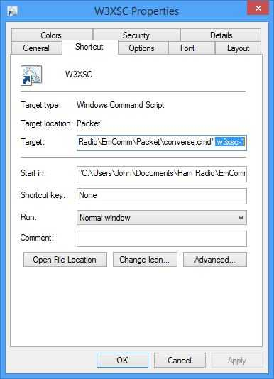
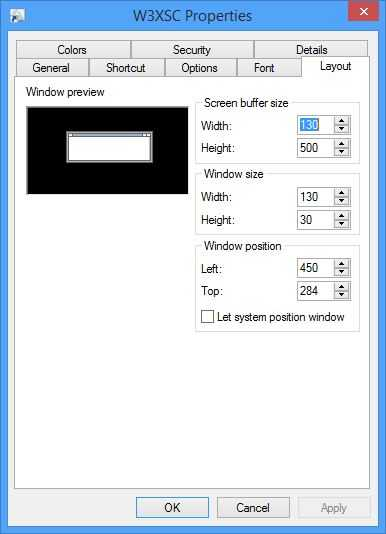

## Polling a BBS

I often connect to a BBS, send some messages,
download some messages, disconnect, and
repeat the whole cycle every few minutes.
To make this easier, I created a shortcut on my desktop that
opens a window and connects to the BBS.
I use [QuickEdit](https://www.techjunkie.com/boost-productivity-quickedit-mode-windows-command-prompt/)
to send messages and save downloaded messages in files.
After I disconnect from the BBS,
I can close the window, or press Enter to connect again.
Here's [a demonstration](https://youtu.be/FF3VRsufewo).

Here's how I made this.
In the same folder that contains converse.exe,
create a file named converse.cmd that contains:
```
:repeat
@.\converse.exe w6jmk %1
@pause
@goto repeat
```
Then [create a shortcut](https://www.computerhope.com/issues/ch000739.htm) to converse.cmd.
Rename the shortcut to the name of the BBS.
[Open the shortcut properties](https://windows.tips.net/T010869_Changing_Shortcut_Properties.html).
In the Target field of the Shortcut tab, append a space and the call sign of the BBS:



In the Layout tab, set the screen buffer width and window width to a fairly large value.
I chose 130:



Here's how it works. When I open the shortcut, it
opens a Command Prompt window and runs converse.cmd in that window.
The shortcut passes the BBS call sign to converse.cmd as %1.
Then converse.cmd runs converse.exe with my call sign and the BBS call sign.
When I disconnect from the BBS, converse.exe exits and converse.cmd executes
[pause](https://learn.microsoft.com/en-us/windows-server/administration/windows-commands/pause),
which asks me if I want to continue.
If so, it loops back to `repeat` and so on.

You can make a similar .cmd script and shortcut.
You can customize your call sign, the BBS call sign,
options to converse.exe and the layout, colors and font of the window.
You can create more shortcuts that connect to other remote stations.

73, John Kristian W6JMK
