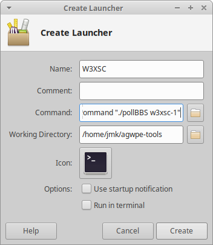

## Polling a BBS

I often connect to a BBS, send some messages,
download some messages, disconnect, and
repeat the whole cycle every few minutes.
To make this easier, I created a launcher on my Xubuntu XFCE desktop that
opens a window and connects to the BBS.
I use [copy-n-paste](https://docs.xfce.org/apps/xfce4-terminal/usage#working_with_the_contents_of_terminal_windows)
to send messages and save downloaded messages in files.
After I disconnect from the BBS,
I can close the window, or press Enter to connect again.
Here's [a demonstration](https://youtu.be/-RlAvVLj2IA).

Here's how I made this.
In the same folder that contains converse,
create a file named pollBBS that contains:
```
#!/bin/bash
while true; do
    ./converse w6jmk "$@"
    echo
    read -p "Press Enter to repeat:" || break
done
echo
```
Make this file executable, with the shell command `chmod +x pollBBS`.
Then [create a launcher](https://docs.xfce.org/xfce/exo/desktop-item-edit) with:
- Name: W3XSC
- Command: `xfce4-terminal --geometry=130x24+100+30 --command "./pollBBS w3xsc-1"`
- Working Directory: (the directory that contains pollBBS)



Here's how it works. When I execute the launcher, it
opens a terminal window and runs pollBBS in that window.
The launcher passes the BBS call sign to pollBBS as $1.
Then pollBBS runs converse with my call sign and the BBS call sign.
When I disconnect from the BBS, converse exits and pollBBS executes
[read](https://www.gnu.org/software/bash/manual/bash.html#index-read),
which asks me if I want to repeat the process.

You can make a similar pollBBS script and launcher.
You can customize your call sign, the BBS call sign,
options to converse and the layout, colors and font of the window.
You can create more launchers that connect to other remote stations,
by passing different arguments to pollBBS.

To use a different terminal, you can make the launcher run a different Command,
for example:
- `gnome-terminal --geometry=130x24+100+30 -- ./pollBBS w3xsc-1`
- `konsole -p "TerminalColumns=130" -e "./pollBBS w3xsc-1"`

For the GNOME desktop, you can use
[alacarte](https://www.makeuseof.com/tag/edit-system-menu-items-alacarte-linux/)
to add a launcher to the Applications menu.

73, John Kristian W6JMK
